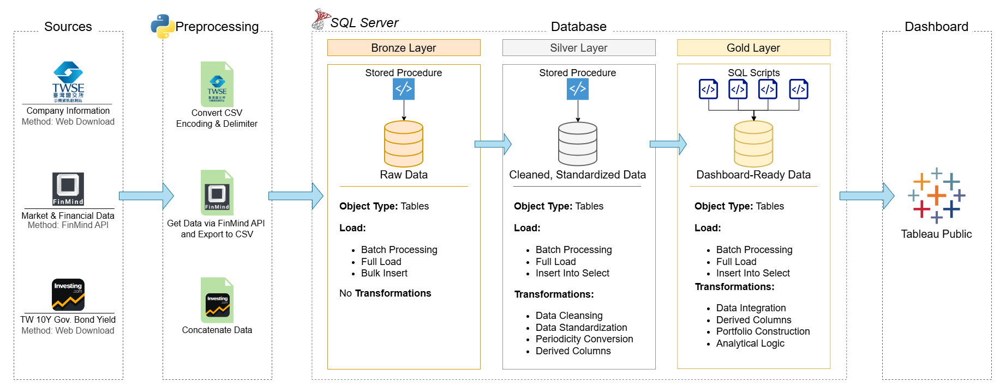
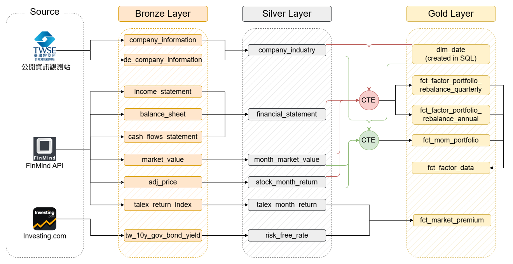

# tw_fama_factor_dashboard

Welcome to the **Fama-French Factor Dashboard Project** repository! 📊    
This project presents an end-to-end workflow for constructing Fama-French factors and developing a Tableau dashboard for the Taiwan stock market.
The project integrates **Python**, **SQL Server**, and **Tableau** to build a structured data pipeline, construct factor-based portfolios, and create interactive visualizations.

---
## 📌 Project Overview

This project involves:

1. **Data Collection**: Collecting Taiwan stock market and financial data from **FinMind API** using Python.
2. **Data Architecture**: Organizing data using the Medallion Architecture with **Bronze**, **Silver**, and **Gold** layers in SQL Server.
3. **Data Processing & Transformation**: Cleaning and transforming raw data into dashboard-ready datasets.
4. **Factor & Portfolio Construction**: Constructing Fama-French factors and factor-sorted portfolios in SQL Server.
5. **Dashboard & Analytics**: Developing an interactive Tableau dashboard to analyze historical performance and calculate risk-return metrics.

---
## 🏗️ Data Architecture
The data architecture for this project follows Medallion Architecture **Bronze**, **Silver**, and **Gold** layers:

1. **Bronze Layer**: Stores data that has been preprocessed using Python. Data is loaded from CSV files into SQL Server.
2. **Silver Layer**: Cleans, standardizes, and transforms data, including calculating derived columns, to prepare data for portfolio construction.
3. **Gold Layer**: Constructs Fama-French factors and portfolios to create dashboard-ready datasets for Tableau Public.

---
## 🔀 Data Flow
The diagram below illustrates how data flows through the Bronze, Silver, and Gold layers, highlighting data transformations and dependencies between tables.

---
## 🛠️ Important Links & Tools:

